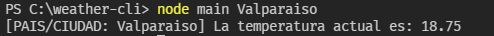

# Weather command line interface
Command line interface para determinar la temperatura actual de una ubicación.

### Requerimientos
- Se requiere `nodejs` para poder ejecutarse.
> Este programa es solamente de uso educativo, dificilmente será actualizado.

### ¿Como usarlo?
1. Descargar el `source_code` o esta mismo repositorio.
2. Abrir tu IDE favorito y dentro de éste abrir una nueva terminal.
3. Dentro de la terminal escribiran el siguiente comando: `node main <Pais/Ciudad>` (despues de main viene el país o ciudad)

### Assets
</img>
